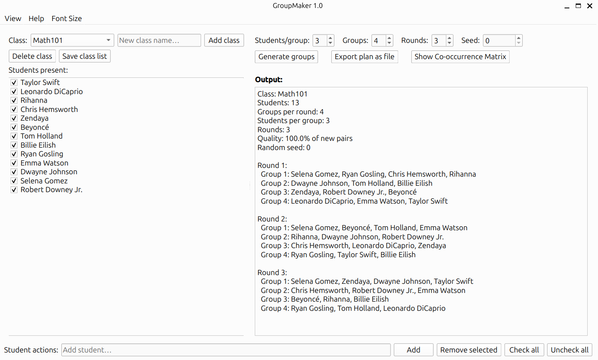
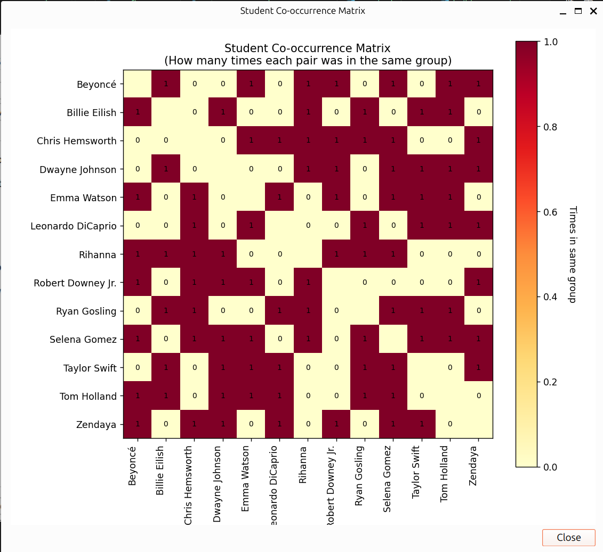

# GroupMaker

**GroupMaker** is a desktop application for teachers to create random student groups with minimal pair repetition.  
Built with **Python** and **PySide6**, packaged as a standalone executable (no Python installation required).

---

## 📸 Screenshot




---

## ✨ Features

- **Class Management**: Add and manage multiple classes with automatic JSON storage
- **Attendance Tracking**: Use checkboxes to mark present students (only present students are grouped)
- **Flexible Grouping**: Adjust number of groups, rounds, restarts, and random seed
- **Quality Metrics**: View detailed grouping results with quality index
- **Co-occurrence Matrix**: Visual heatmap showing how often students are paired together
- **Export Plans**: Save grouping schedules as `.txt` files
- **Dark/Light Mode**: Toggle between themes via View menu
- **Adjustable Font Size**: 8pt-24pt options for better visibility

---

## 🚀 Run from Source

### Prerequisites
- Python 3.9+
- Virtual environment (recommended)

### Setup and Run
```bash
# Create virtual environment
python3 -m venv .venv
source .venv/bin/activate  # Linux/Mac
# .venv\Scripts\activate   # Windows

# Install dependencies
pip install -r dev-scripts/requirements.txt

# Run application
./run-dev.sh              # Linux/Mac
python group-maker.py     # Windows
```

---

## 📦 Download (Linux)

### AppImage (Recommended)
Download the portable AppImage - no installation required:

```bash
# Download latest release
wget https://github.com/magnussimonsen/StudentGroupMaker/releases/latest/download/GroupMaker-x86_64.AppImage

# Make executable
chmod +x GroupMaker-x86_64.AppImage

# Run (if you get FUSE errors, see below)
./GroupMaker-x86_64.AppImage
```

**FUSE Issues?** If you see errors about FUSE or mounting, use:
```bash
./GroupMaker-x86_64.AppImage --appimage-extract-and-run
```

This is common on Ubuntu 24.04+ and is the recommended method for modern Linux systems.

---

## 🚀 Run from Source

### Prerequisites
- Python 3.9+
- Virtual environment (recommended)

### Setup and Run
```bash
# Create virtual environment
python3 -m venv .venv
source .venv/bin/activate  # Linux/Mac
# .venv\Scripts\activate   # Windows

# Install dependencies
pip install -r dev-scripts/requirements.txt

# Run application
./run-dev.sh              # Linux/Mac
python group-maker.py     # Windows
```

---

## 🔨 Build Standalone Executable

### Linux
```bash
# Activate virtual environment
source .venv/bin/activate

# Build executable
./build-wrapper.sh
# or
python dev-scripts/build.py

# Output: dist/GroupMaker (~90MB)
```

### Linux AppImage
```bash
# First build the executable (see above)
./build-wrapper.sh

# Then build AppImage
./app-image-scripts/build-appimage.sh

# Output: GroupMaker-x86_64.AppImage (~98MB)
```

### Windows
```bash
# Activate virtual environment
.venv\Scripts\activate

# Build executable
python dev-scripts/build.py

# Output: dist\GroupMaker.exe
```

The build script automatically includes all dependencies (PySide6, matplotlib, etc.) using PyInstaller.

---

## 🖱️ How to Use

1. **Create/Select Class**: Use the class dropdown or "New Class" button
2. **Add Students**: Enter student names and click "Add Student"
3. **Mark Attendance**: Check boxes next to present students
4. **Configure Groups**: Set number of groups, rounds, and restarts
5. **Generate Plan**: Click "Generate plan" to create random groups
6. **View Matrix**: Click "Show Co-occurrence Matrix" to see pairing patterns
7. **Export**: Save the plan to a text file

---

## 📂 Data Storage

Student lists are automatically saved as JSON files in:
```
~/.GroupMaker/classes/
```

---

## 🧠 Algorithm

- Uses a **greedy randomized heuristic** to minimize repeated pairs
- Higher **restarts** improve pairing diversity (but take longer)
- **Quality index** shows pairing uniformity (lower is better)

---

## 🛡️ License

MIT License

Copyright (c) 2025 Magnus Simonsen

Permission is hereby granted, free of charge, to any person obtaining a copy
of this software and associated documentation files (the "Software"), to deal
in the Software without restriction, including without limitation the rights
to use, copy, modify, merge, publish, distribute, sublicense, and/or sell
copies of the Software, and to permit persons to whom the Software is
furnished to do so, subject to the following conditions:

The above copyright notice and this permission notice shall be included in all
copies or substantial portions of the Software.

THE SOFTWARE IS PROVIDED "AS IS", WITHOUT WARRANTY OF ANY KIND, EXPRESS OR
IMPLIED, INCLUDING BUT NOT LIMITED TO THE WARRANTIES OF MERCHANTABILITY,
FITNESS FOR A PARTICULAR PURPOSE AND NONINFRINGEMENT. IN NO EVENT SHALL THE
AUTHORS OR COPYRIGHT HOLDERS BE LIABLE FOR ANY CLAIM, DAMAGES OR OTHER
LIABILITY, WHETHER IN AN ACTION OF CONTRACT, TORT OR OTHERWISE, ARISING FROM,
OUT OF OR IN CONNECTION WITH THE SOFTWARE OR THE USE OR OTHER DEALINGS IN THE
SOFTWARE.

---

## 🙌 Acknowledgements

- **PySide6** (Qt for Python) for the GUI framework
- **matplotlib** for co-occurrence matrix visualization
- **PyInstaller** for executable packaging
