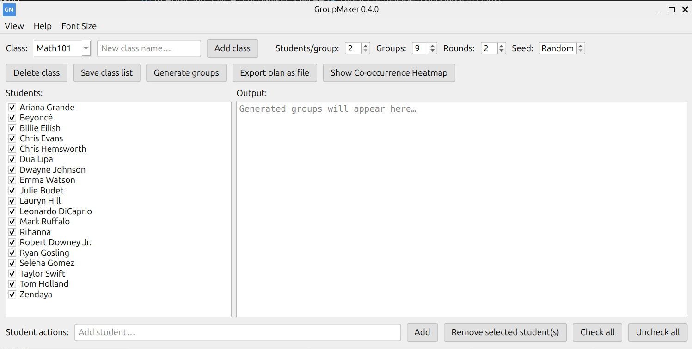
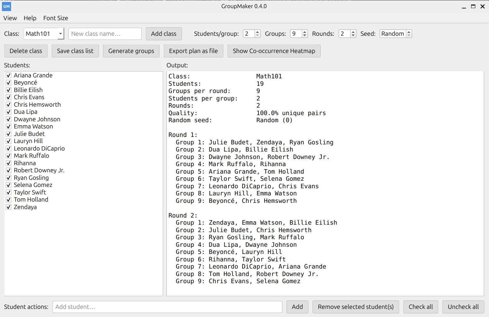
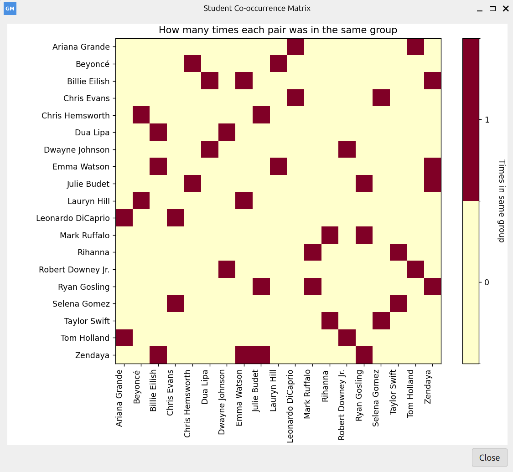

# GroupMaker

Create random student groups with minimal pair repetition. Built with Python + PySide6.

## Screenshot





## Download
- Latest releases (Windows + Linux):
	- https://github.com/magnussimonsen/StudentGroupMaker/releases/latest

## Features
- Manage classes; mark present students
- Configurable groups, rounds, and seed (0 = Random)
- Quality score and co‑occurrence heatmap
- Export plan to .txt
- Light/Dark theme and adjustable font size

## Run from source
```bash
python3 -m venv .venv
source .venv/bin/activate
pip install -r requirements.txt
python3 group-maker.py
```

## Linux AppImage
```bash
wget https://github.com/magnussimonsen/StudentGroupMaker/releases/latest/download/GroupMaker-x86_64.AppImage
chmod +x GroupMaker-x86_64.AppImage
./GroupMaker-x86_64.AppImage
# If you hit FUSE issues:
./GroupMaker-x86_64.AppImage --appimage-extract-and-run
```

## Build (optional)
- Linux executable: `./build-wrapper.sh` → `dist/GroupMaker`
- AppImage: `./app-image-scripts/build-appimage.sh` → `GroupMaker-x86_64.AppImage`
- Windows: build with PyInstaller on Windows


## License
MIT
